# place-search-platform

> 내 동네 맛집·카페·놀거리를 찾아주는 검색·추천 서비스 — 그리고 여러 서비스가 공통으로 가져다 쓸 수 있게 만든 "검색 플랫폼"

**상태:** 🟢 **6/8 단계 구현·실측 완료** (키워드·벡터·하이브리드 검색 동작) · 🗺️ [로드맵](docs/roadmap.md)

---

## 이게 뭔가요

장소를 검색하고 추천받는 서비스예요. 그런데 목표가 "검색 기능 하나 만들기"가 아니에요.
**여러 서비스가 똑같이 가져다 쓸 수 있는 검색·추천 '플랫폼'을, 처음부터 직접 설계해보는 것**이 목표예요.

왜 이런 걸 만드냐면 — 회사에서 하는 검색·추천 일은 코드를 밖에 보여줄 수 없어요.
그래서 제가 실무에서 매일 다루는 문제(검색 엔진 운영, 색인 파이프라인, 키워드+벡터 검색)를
**공개해도 되는 버전으로 똑같이 만들어서, "이런 걸 설계할 줄 안다"를 눈으로 보여주려고** 합니다.

### 이 저장소에서 봐주셨으면 하는 것

기능 목록보다 이 세 가지예요.

1. **결정마다 근거가 있어요** — [ADR 10편](#왜-이렇게-만들었나-설계-결정-기록). "무엇을 썼나"가 아니라 "왜 그걸 골랐고, 무엇을 포기했나"를 남겼어요.
2. **감이 아니라 실측으로 정했어요** — 설정값을 짐작으로 정한 뒤 재보니 **아무 일도 안 하고 있던** 경우가 실제로 있었어요. ([문턱값 0.78 → 0.84](docs/adr/0010-embedding-model-and-serving.md))
3. **안 되는 것도 적었어요** — [셀프 크리틱 19건](docs/architecture-review.md). 예상이 틀렸을 때 고쳐진 척하지 않았어요.

## 지금 진짜로 되는 것

강남구 상가정보 **64,239건**으로 실제 동작·측정한 결과예요.

| API | 하는 일 |
|---|---|
| [`GET /v1/search`](docs/api-spec.md#get-v1search) | **글자로** 찾기 — BM25 + KOMORAN 형태소 분석. 0건이면 조건을 풀어 재질의 |
| [`GET /v1/suggest`](docs/api-spec.md#get-v1suggest) | 자동완성 — edge_ngram |
| [`GET /v1/instant`](docs/api-spec.md#get-v1instant) | 추천어 + 결과 미리보기를 **한 번에** (코루틴 팬아웃) |
| [`GET /v1/vsearch`](docs/api-spec.md#get-v1vsearch) | **뜻으로** 찾기 — 임베딩 + Qdrant |
| [`GET /v1/hsearch`](docs/api-spec.md#get-v1hsearch) | **둘을 합쳐서** 찾기 — 앱단 RRF |
| `POST /admin/(vector/)reindex[/incremental]` | 무중단 전체 재색인 · 증분 색인 |

```bash
# 글자가 하나도 안 겹치는데 찾아내요
curl -G localhost:8080/v1/hsearch --data-urlencode "q=회 먹을 데"
#  → 먹어도[횟집] · 마시아[일식 회/초밥] · 어방참치[일식 회/초밥]
```

## 재본 결과

### 검색 품질 — 실제로 칠 법한 질의 20개

| 채널 | 0건이 나온 질의 |
|---|---|
| 키워드만 | **10 / 20** |
| **하이브리드** | **1 / 20** |

`회 먹을 데`·`머리 자르는 곳`·`매운 거 먹고 싶다` 처럼 **글자가 하나도 안 겹치는 말**이
전부 살아났어요. 형태소 사전을 아무리 채워도 안 되는 종류의 0건이에요.

### 지연 (예열 후, Prometheus 카운터 차분)

| 채널 | 평균 |
|---|---|
| 키워드 | 9.2ms |
| 벡터 | 4.9ms |
| **하이브리드** | **16.3ms** (└ RRF 계산 자체는 **0.21ms**) |

"벡터는 무겁다"는 통념이 **6만 건 규모에선 사실이 아니었어요.** 그리고 결합 비용은
합치는 계산이 아니라 **두 번 부르고 깊게 뜨는 것**에 있었어요.

### 무중단 · 장애

| 확인한 것 | 결과 |
|---|---|
| 전체 재색인 중 검색 (키워드) | 90회 요청 · 실패 0 |
| alias 20회 왕복 스왑 중 검색 (벡터) | 230회 요청 · 실패 0 · 빈 결과 0 |
| Qdrant / ES 컨테이너 중단 | `200` + `degraded:true` — **반쪽으로라도 답하고, 반쪽인 걸 알려줘요** |

## 어떻게 동작하나요



큰 흐름은 이래요.

1. 공공데이터(상가정보)를 **원천 창고(PostGIS)** 에 모아둬요.
2. 데이터가 **바뀔 때만** 그 부분만 검색 엔진에 반영해요. (전체를 매번 새로 만들지 않아요)
3. 사용자가 검색하면, 서버가 **키워드 엔진과 뜻 엔진에 동시에** 물어봐요.
4. 두 답을 **등수 기준으로** 합쳐서 돌려줘요.

더 자세한 그림과 각 조각의 역할은 → [docs/architecture.md](docs/architecture.md)

## 왜 이렇게 만들었나 (설계 결정 기록)

결정마다 "왜 이걸 골랐는지"를 짧은 문서로 남겼어요. **이 문서들이 이 프로젝트의 진짜 알맹이예요.**

| | 무엇을 정했나 |
|---|---|
| [0001](docs/adr/0001-event-triggered-incremental-indexing.md) | 데이터를 언제 색인할까 — 실시간 말고 '바뀔 때만' |
| [0002](docs/adr/0002-index-and-cluster-separation.md) | 검색 인덱스를 용도별로 나눈 이유 |
| [0003](docs/adr/0003-hybrid-search-rrf-in-app-layer.md) | 키워드·벡터 결과를 앱에서 합치는 방법 (RRF) |
| [0004](docs/adr/0004-cookieless-session-model.md) | 쿠키 없이 세션 다루기 (프라이버시) |
| [0005](docs/adr/0005-cold-start-and-recommend-strategy.md) | 처음 온 사람에게 뭘 보여줄까 (콜드스타트) |
| [0006](docs/adr/0006-api-runtime-reactive-vs-blocking.md) | 서버를 리액티브(WebFlux+코루틴)로 짠 이유 |
| [0007](docs/adr/0007-vector-engine-qdrant-vs-milvus.md) | 벡터 엔진 선택 — ES 내장 vs 별도 엔진, Qdrant vs Milvus |
| [0008](docs/adr/0008-korean-analyzer-komoran-vs-nori.md) | 한국어 형태소 분석기 — nori vs KOMORAN, 그리고 왜 플러그인을 직접 포팅했나 |
| [0009](docs/adr/0009-keyword-ranking-and-fallback.md) | 키워드 랭킹과 0건 폴백 규칙 |
| [0010](docs/adr/0010-embedding-model-and-serving.md) | 임베딩 모델 선택과 **앱 안에서** 추론하는 이유 |

### 특히 봐주셨으면 하는 두 편

- **[0008](docs/adr/0008-korean-analyzer-komoran-vs-nori.md)** — KOMORAN 플러그인이 최신 ES를 지원하지 않아 **직접 재포팅**했어요.
  그리고 "품질 좋은 분석기를 골랐다"로 끝내지 않고, 4단계에서 검색 품질을 재다가 **1단계로 되돌아가** 사전과 stoptags를 다시 정했어요.
- **[0010](docs/adr/0010-embedding-model-and-serving.md)** — 임베딩 추론을 별도 서버로 빼지 않고 앱 안에 뒀어요.
  색인과 검색이 **다른 모델을 보면 조용히 망가지는데**, 그 사고를 3단계에서 사전으로 이미 한 번 겪었기 때문이에요.

## 정직하게 남긴 것

[**docs/architecture-review.md**](docs/architecture-review.md) — 스스로 찾은 결함 19건이에요.
고친 것은 고쳤다고, 못 고친 것은 왜 못 고쳤는지 적었어요. 몇 가지만 옮기면:

- **문턱값을 감으로 정했더니 아무것도 안 막고 있었어요.** 재보고 0.78 → 0.84로 고쳤어요.
- **그런데 문턱값이라는 방법 자체가 한계였어요.** 진짜 질의(0.844~0.883)와 엉터리 질의(0.794~0.870)의 **점수 분포가 겹쳐요.**
- **"하이브리드가 이걸 해결한다"고 적었는데 반만 맞았어요.** 못 찾던 걸 찾는 건 해결됐지만, 엉뚱한 걸 거르는 건 아직이에요.
- **8분 33초짜리 색인을 마지막 1초 단계에서 날렸어요.** URL 오타 하나 때문에요. 데이터는 살아 있었지만 **복구 경로가 API에 없다**는 걸 알았어요.

## 로컬에서 실행하기

```bash
# 1) 검색 스택 (KOMORAN 플러그인 빌드 → ES 커스텀 이미지 → compose up)
./deploy/up.sh

# 2) 원천 데이터 적재 (PostGIS)
#    먼저 서울 상가정보 CSV 를 data/raw 에 두세요 — 출처는 docs/data-model.md
./scripts/load_place.sh

# 2-1) 두 번째 원천 + 행정동 경계 (상가정보가 못 담는 직영 프랜차이즈를 메움)
./scripts/load_boundaries.sh
./scripts/load_localdata.sh

# 3) 임베딩 모델 내려받기 (470MB — 벡터/하이브리드 검색에 필요)
./scripts/fetch_embedding_model.sh

# 4) 앱 기동
cd services/search-api && ./gradlew bootRun

# 5) 색인 (키워드 · 벡터)
curl -XPOST localhost:8080/admin/reindex
curl -XPOST localhost:8080/admin/vector/reindex   # 6만 건에 약 9분 — 95.8%가 임베딩 추론
```

그리고 브라우저에서 **<http://localhost:8080/>** 을 열면 같은 질의를 **세 채널에 동시에** 던져
나란히 볼 수 있어요. 앱이 직접 서빙하는 정적 페이지 한 장이라, 별도 서버도 빌드 도구도 없어요.

같은 아티팩트를 **역할별로 나눠** 띄울 수 있어요. 질의 노드에는 `/admin/*` 이 아예 없고,
키워드 전용 노드는 임베딩 모델을 읽지 않아요(메모리 0.5GB·기동 5.7초 절약).

```bash
./gradlew bootRun --args='--psp.role.indexer=false'    # 질의 전용
./gradlew bootRun --args='--psp.vector.enabled=false'  # 키워드 전용
```

## 문서 지도

| 문서 | 내용 |
|---|---|
| [glossary.md](docs/glossary.md) | **용어 사전** — 문서에 나오는 말을 쉬운 말로 |
| [api-spec.md](docs/api-spec.md) | API 명세 — 파라미터·응답·주의점 |
| [architecture.md](docs/architecture.md) | 구조와 각 조각의 역할 |
| [architecture-review.md](docs/architecture-review.md) | **셀프 크리틱 19건** |
| [data-model.md](docs/data-model.md) | 원천 데이터 스키마와 출처 |
| [roadmap.md](docs/roadmap.md) | 8단계 계획과 단계별 실측 기록 |
| [adr/](docs/adr/) | 설계 결정 기록 10편 |

## 기술 스택

Kotlin · Spring Boot(WebFlux) · Kotlin 코루틴 · Elasticsearch(+ 직접 포팅한 KOMORAN 플러그인) ·
Qdrant · DJL/ONNX Runtime · PostgreSQL/PostGIS · Redis · Docker Compose · Micrometer/Prometheus

> Kubernetes·Kafka·멀티클러스터는 **설계 문서로만** 남겼어요 — 로컬 데모 범위를 넘어서서,
> 구조와 근거만 적고 구현하지 않았어요. ([로드맵](docs/roadmap.md#설계-문서로만-남기는-범위-이번엔-구현하지-않음))
