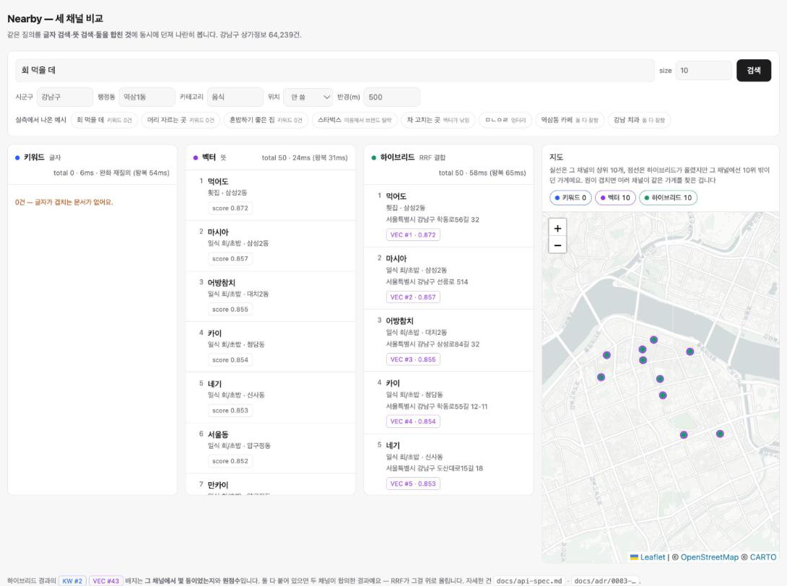
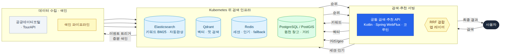
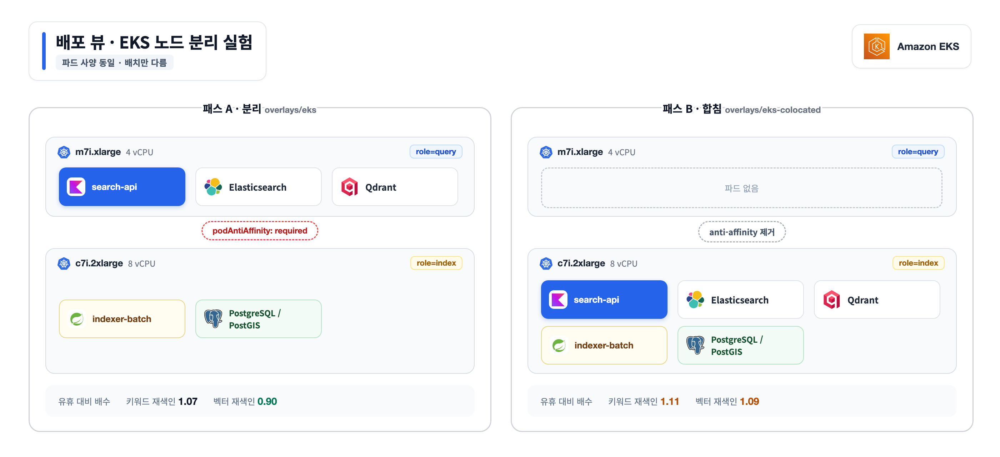

# Nearby

> **키워드 · 벡터 · 하이브리드 검색을 한 플랫폼에서.**
> 강남구 상가 64,239건으로 색인부터 질의까지 돌아가는 지역 검색 시스템입니다.

[](https://github.com/YubinShin/nearby/actions/workflows/build.yml)




`회 먹을 데` — 키워드 0건, 벡터와 하이브리드는 50건. 
*화면의 ms 는 데모 위하여 세 채널을 동시에 호출한 값으로 각 채널의 실측 값은 아래 [실측](#실측)의 채널별 수치를 참고 바랍니다*

---

## 한눈에

강남구 상가정보 **64,239건**으로 검색 파이프라인을 끝까지 돌리고, 결정마다 [ADR 14편](docs/adr/)과
실측을 남겼습니다.

| | |
| --- | --- |
| **결과 0건 질의** | 키워드 7/20 → 하이브리드 **0/20** |
| **응답 시간** | 하이브리드 중앙값 **9.7ms** (RRF 결합 자체는 평균 0.04ms · 2026-08-03 실측) |
| **무중단 재색인** | 20만+ 요청 동안 **실패 0 · 빈 결과 0** (EKS·Spring Batch 색인기 실측) |
| **노드 분리 효과** | 벡터 재색인 중 질의 지연 **1.09 → 0.90** (EKS 실측) |
| **이미지 공유** | 두 앱 합산 1,403MB → **917MB** |

*결과 0건 질의: 검색 결과가 하나도 없었던 질의. 실제로 칠 법한 질의 20개 중 몇 개가 그랬는지.*

---

## 무엇을 하나

`회 먹을 데` 처럼 **단어가 하나도 일치하지 않는 질의**도 검색됩니다.

```bash
curl -G localhost:8080/v1/hsearch --data-urlencode "q=회 먹을 데"

→ 먹어도
→ 마시아
→ 어방참치
```

키워드는 BM25 + KOMORAN 형태소 분석으로, 벡터는 임베딩으로 찾고, 둘을 애플리케이션
레이어에서 **RRF(등수 결합)** 로 합칩니다. 한 채널이 죽어도 나머지 반쪽으로 답합니다
(`degraded: true`).

브라우저에서 `localhost:8080` 을 열면 같은 질의를 **세 방식으로 나란히 비교**합니다.

---

## 빠른 시작

```bash
# 1. 인프라 (Elasticsearch + Qdrant + PostGIS + Redis)
./deploy/up.sh

# 2. 원천 데이터와 임베딩 모델
./scripts/load_place.sh
./scripts/fetch_embedding_model.sh

# 3. 색인기 (8081) — 원천을 읽어 검색 엔진에 밀어넣습니다
cd services && ./gradlew :indexer-batch:bootRun

curl -XPOST localhost:8081/admin/reindex          # 키워드 · 15.6초 (2026-07-25 실측)
curl -XPOST localhost:8081/admin/vector/reindex   # 벡터 · 8분 32초 (2026-07-25 실측)

# 4. 검색기 (8080)
./gradlew :search-api:bootRun
```

재색인은 **접수만 하고 즉시 `202 + jobId`** 를 돌려줍니다. `curl` 을 끊어도 색인은 계속 돕니다.
진행 상황은 `GET /admin/jobs/{jobId}` 로 조회합니다.

Kubernetes로 띄우려면 → [deploy/k8s/README.md](deploy/k8s/README.md)

---

## API

| API | 설명 |
| --- | --- |
| [`GET /v1/search`](docs/api-spec.md#get-v1search) | 키워드 검색 |
| [`GET /v1/vsearch`](docs/api-spec.md#get-v1vsearch) | 벡터 검색 |
| [`GET /v1/hsearch`](docs/api-spec.md#get-v1hsearch) | 하이브리드 검색 |
| [`GET /v1/suggest`](docs/api-spec.md#get-v1suggest) | 자동완성 |
| [`GET /v1/instant`](docs/api-spec.md#get-v1instant) | 추천어 + 결과 미리보기 |
| [`POST /admin/reindex`](docs/api-spec.md#post-adminreindex) | 전체 재색인 |
| [`POST /admin/reindex/incremental`](docs/api-spec.md#post-adminreindexincremental) | 증분 색인 |
| [`GET /admin/jobs/{jobId}`](docs/api-spec.md#get-adminjobsjobid) | 색인 진행·결과 |
| [`GET /v1/ask`](services/ask-api/README.md) | 자연어 질의 이해 — **`ask-api`(8082)** |

전체 명세 → [docs/api-spec.md](docs/api-spec.md)

---

## 기능

**검색**

- [x] BM25 + KOMORAN 키워드 검색 · 0건 시 조건 완화 폴백
- [x] 임베딩 + Qdrant 벡터 검색 (엔진 내 필터·반경)
- [x] Application Layer RRF 하이브리드
- [x] Coroutine Fan-out 병렬 질의
- [x] edge_ngram 자동완성
- [x] LLM 질의 이해 — 자연어를 검색 요청으로 (`ask-api`) ·
  [ADR 0014](docs/adr/0014-ask-api-llm-query-understanding.md)

**색인**

- [x] Watermark 기반 증분 색인
- [x] Alias Swap 무중단 재색인 · 버전 인덱스 reconcile
- [x] 색인 계약 **런타임 버전 도장** — 모델·스키마가 어긋나면 질의기 기동 차단
- [ ] 이벤트 트리거 색인 — [ADR 0001](docs/adr/0001-event-triggered-incremental-indexing.md)

**운영**

- [x] 색인기 / 질의기 **별도 아티팩트** 분리
- [x] Kubernetes 배포 (kustomize · kind · EKS) · 노드 분리 실측
- [x] 채널 장애 시 `degraded: true` 부분 응답
- [x] Micrometer + Prometheus 메트릭
- [ ] Kafka 스트리밍 색인 — 자리를 [`indexer-stream`](services/indexer-stream/README.md) 빈 모듈로 확보
- [ ] 멀티클러스터 — [ADR 0002](docs/adr/0002-index-and-cluster-separation.md)

**추천**

- [ ] 인기 + 거리 콜드 스타트 — [ADR 0005](docs/adr/0005-cold-start-and-recommend-strategy.md)
- [ ] Cookie-less Session — [ADR 0004](docs/adr/0004-cookieless-session-model.md)

---

## 아키텍처

검색 요청은 키워드·벡터를 **병렬 수행**한 뒤 애플리케이션 레이어에서 RRF로 결합합니다.
원천(PostGIS)은 체크포인트를 watermark로 삼아 바뀐 행만 증분 색인하고, Alias Swap으로
무중단 교체합니다.



**색인기와 질의기는 별도 아티팩트입니다.** 자원 성격이 반대이고(색인은 CPU 버스트 — 벡터
재색인의 96%가 임베딩 추론, 질의는 저지연 상시), 한 프로세스에 두면 색인 쪽 OOM 한 번이 곧
검색 장애가 됩니다. 런타임도 다릅니다 — 질의기는 WebFlux + Coroutine, 색인기는 Spring Batch.

공유해야 하는 것(문서 스키마 · 브랜드 규칙 · 임베딩 모델)은 `search-core` 한 벌만 두고,
따로 배포되며 어긋나는 것은 **런타임 버전 도장**으로 막습니다.

```
search-core     공유 계약 (문서 스키마 · 브랜드 규칙 · 임베딩 모델)
├── search-api      질의  · WebFlux + Coroutine
├── indexer-batch   색인  · Spring Batch + MVC + JDBC
└── indexer-stream  (TBD) 이벤트 색인

ask-api         자연어 질의 이해 · core 에 의존하지 않고 /v1/hsearch 를 HTTP 로 호출
```

분리의 효과는 EKS 2노드에서 실측했습니다 — 두 패스는 파드 사양이 같고 **배치만 다릅니다**.
벡터 재색인 중 질의 지연은 1.09 → **0.90**으로 회복되고, 키워드는 1.11 → 1.07로 남습니다.
방법론 → [ADR 0011](docs/adr/0011-module-split-and-index-contract.md)



자세히 → [docs/architecture.md](docs/architecture.md)

---

## 실측

측정 방법과 전체 결과는 문서에 있습니다. 대표값만 옮깁니다.

**검색 품질** — 실제로 칠 법한 질의 20개(`scripts/queries_regression.txt`), 2026-08-03 실측

| 방식 | 결과 0건 질의 | 중앙값 | p95 |
| --- | --- | --- | --- |
| 키워드 | 7 / 20 | 5.3ms | 9.1ms |
| 벡터 | 2 / 20 | 4.4ms | 5.0ms |
| **하이브리드** | **0 / 20** | **9.7ms** | 16.2ms |

세 경로가 같은 질의에 *왜* 다르게 답하는지 → [search-modes-comparison.md](docs/search-modes-comparison.md)
하이브리드 내부 keyword/vector/hydrate/fuse 단계별 평균 → [ADR 0011](docs/adr/0011-module-split-and-index-contract.md)

**노드를 나누면 나아지는가** — EKS 두 노드, 같은 파드 스펙으로 배치만 바꿔 2회 측정

| 구간 | 분리 | 합침 |
| --- | --- | --- |
| 벡터 재색인 중 (유휴 대비) | **0.90** | 1.09 |
| 키워드 재색인 중 (유휴 대비) | 1.07 | 1.11 |

벡터는 비용의 96%가 앱 CPU라 노드를 나누면 회복되고, 키워드는 비용이 **공유 ES의 `_bulk`** 라
회복되지 않습니다 — 앱 배치가 아니라 클러스터 분리가 필요한 영역입니다.
전체 결과·교란 요인 → [ADR 0011](docs/adr/0011-module-split-and-index-contract.md)

**이미지** — 두 앱이 같은 임베딩 모델(470MB)을 씁니다. 모델만 담은 베이스 이미지를 상속시켜
합산 1,403MB → **917MB**. 절약분 486MB는 모델 + 토크나이저와 정확히 일치합니다.

---

## 설계 결정

주요 결정과 트레이드오프를 [ADR 14편](docs/adr/)에 기록했습니다.

| | 결정 | 상태 |
| --- | --- | --- |
| [0001](docs/adr/0001-event-triggered-incremental-indexing.md) | 이벤트 기반 증분 색인 | 증분 구현 · 트리거 예정 |
| [0002](docs/adr/0002-index-and-cluster-separation.md) | 인덱스·클러스터 분리 | 인덱스 구현 · 클러스터 예정 |
| [0003](docs/adr/0003-hybrid-search-rrf-in-app-layer.md) | Application Layer RRF | 구현 |
| [0004](docs/adr/0004-cookieless-session-model.md) | Cookie-less Session | 예정 |
| [0005](docs/adr/0005-cold-start-and-recommend-strategy.md) | Cold Start | 예정 |
| [0006](docs/adr/0006-api-runtime-reactive-vs-blocking.md) | 질의기 WebFlux + Coroutine | 구현 |
| [0007](docs/adr/0007-vector-engine-qdrant-vs-milvus.md) | Qdrant 선택 | 구현 |
| [0008](docs/adr/0008-korean-analyzer-komoran-vs-nori.md) | KOMORAN 재포팅 | 구현 |
| [0009](docs/adr/0009-keyword-ranking-and-fallback.md) | 키워드 랭킹·폴백 | 구현 |
| [0010](docs/adr/0010-embedding-model-and-serving.md) | 임베딩 모델·추론 위치 | 구현 |
| [0011](docs/adr/0011-module-split-and-index-contract.md) | 아티팩트 분리 · 색인 계약 대조 | 구현 |
| [0012](docs/adr/0012-manifests-in-monorepo.md) | 배포 매니페스트를 모노레포에 | 구현 |
| [0013](docs/adr/0013-indexer-runtime-spring-batch.md) | 색인기를 Spring Batch로 | 구현 |
| [0014](docs/adr/0014-ask-api-llm-query-understanding.md) | 자연어 질의 이해를 `ask-api` 로 분리 | 구현 |

각 ADR 하단에 **구현 위치 표**(파일 → 확정 커밋)가 있습니다.

예상과 달랐던 결과와 설계상 한계는 [Architecture Review](docs/architecture-review.md)에
따로 모았습니다.

---

## 기술 스택

| 영역 | 사용 |
| --- | --- |
| 언어 | Kotlin (JVM 21) |
| 질의기 | Spring Boot · WebFlux · Kotlin Coroutine |
| 색인기 | Spring Boot · Spring Batch · MVC · JDBC |
| 검색 엔진 | Elasticsearch 9.4.2 · KOMORAN 플러그인 재포팅 |
| 벡터 | Qdrant · DJL / ONNX Runtime (multilingual-e5-small · 384차원) |
| 원천 | PostgreSQL / PostGIS |
| 배포 | Docker Compose · Kubernetes (kustomize · kind · EKS) |
| 관측 | Micrometer · Prometheus |
| 세션 · 인기 | Redis *(TBD)* |

---

## 문서

| 문서 | 내용 |
| --- | --- |
| [architecture.md](docs/architecture.md) | 아키텍처 |
| [api-spec.md](docs/api-spec.md) | API 명세 |
| [adr/](docs/adr/) | 설계 결정 14편 |
| [architecture-review.md](docs/architecture-review.md) | 예상과 다른 결과·한계 |
| [troubleshooting.md](docs/troubleshooting.md) | 증상별 원인과 조치 |
| [search-modes-comparison.md](docs/search-modes-comparison.md) | 세 검색 방식 비교 |
| [data-model.md](docs/data-model.md) | 데이터 모델·원천 출처 |
| [roadmap.md](docs/roadmap.md) | 로드맵 |
| [glossary.md](docs/glossary.md) | 용어 사전 |
