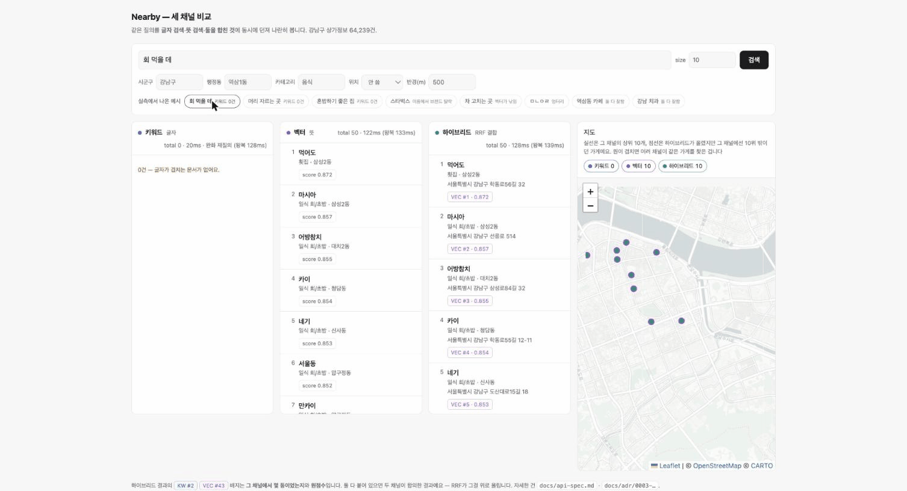

# Search mode comparison

세 검색 경로(`/v1/search` 키워드 · `/v1/vsearch` 벡터 · `/v1/hsearch` 하이브리드)가 같은 질의에 어떻게 다른 결과를 반환하는지를 실제 응답으로 보여줍니다. README의 집계 지표는 "0건 질의: 키워드 7/20 · 벡터 2/20 · 하이브리드 0/20"입니다. 이 문서는 그 원인을 한 질의씩 분석합니다.

데이터: 강남구 상가 64,239곳. 아래 결과는 쿠버네티스(kind)에 배포한 스택에서 측정한 실제 응답입니다.



*질의 세 개(`회 먹을 데` · `머리 자르는 곳` · `혼밥하기 좋은 집`)를 차례로 실행한 화면. 셋 다 키워드는 0건입니다.*

---

## Case 1 — "강남역 카페"

단어가 실제로 존재하는 질의입니다.

### Keyword (`/v1/search`) · 38건 — literal match

| 순위 | 이름 | 카테고리 | BM25 |
|---|---|---|---|
| 1 | 프린트**카페**강남역지하 | **복사업** | 40.7 |
| 2 | 공차강남역점 | 카페 | 38.3 |
| 3 | 투썸플레이스강남역 | 카페 | 38.3 |

BM25는 뜻을 모릅니다. "카페"·"강남역" 글자가 이름에 포함되어 있으면 되므로, 복사집("프린트카페")이 1등으로 올라옵니다. 반대로 이름에 그 글자가 없는 카페는 조회되지 않습니다.

### Vector (`/v1/vsearch`) · 50건 — semantic match

| 순위 | 이름 | 카테고리 | 코사인 | 행정동 |
|---|---|---|---|---|
| 1 | 기로 | 카페 | 0.897 | 역삼2동 |
| 2 | 구름커피 | 카페 | 0.896 | 역삼1동 |
| 3 | 강남커피 | 카페 | 0.896 | 역삼1동 |

전부 진짜 카페입니다. 그런데 이름에 "강남역"이 하나도 없습니다. 임베딩은 "카페다움"(뜻)은 강하게 반영했습니다. 그러나 "강남역"이라는 고유명사 앵커는 희석됐습니다. 그래서 역삼2동처럼 조금 떨어진 카페가 섞입니다.

### Hybrid (`/v1/hsearch`) · 87건 — two-channel consensus (RRF)

| 순위 | 이름 | keyword 등수 | vector 등수 |
|---|---|---|---|
| 1 | **컴포즈커피 강남역점** | 23 | 25 |
| 2 | 기로 | — | 1 |
| 3 | 프린트카페강남역지하 | 1 | — |

1등(컴포즈커피 강남역점)은 어느 채널에서도 1등이 아닙니다(키워드 23등 · 벡터 25등). 그런데 *두 채널 모두*에 나타났기 때문에 RRF가 최상위로 끌어올립니다. 반대로 한 채널에서만 1등이던 프린트카페(키워드 1등)·기로(벡터 1등)는 아래로 내려갑니다.

> 카페면서(뜻) 강남역에 있는(글자) 곳 — 즉 두 신호가 겹치는 곳이 자연스럽게 위로 옵니다. 완충값 `k=60`이 그 균형을 잡습니다 ([ADR 0003](adr/0003-hybrid-search-rrf-in-app-layer.md)).

---

## Case 2 — "분위기 좋은 브런치"

서술형 질의입니다. 말로 풀어쓴 질의를 실행하면:

| 경로 | 후보 수 | 결과 |
|---|---|---|
| 키워드 | **0** | "분위기"·"좋은"·"브런치" 글자가 이름에 포함된 가게가 없습니다 → **결과 없음** |
| 벡터 / 하이브리드 | 50 | **브런치빈강남** · **브런치앤모어** + 브런치스러운 경양식·빵집 |

하이브리드 상위는 전부 벡터 채널에서 온 결과입니다. 키워드는 0건이라 기여분이 없습니다.

| 순위 | 이름 | 카테고리 | 코사인 |
|---|---|---|---|
| 1 | 브런치빈강남 | 경양식 | 0.858 |
| 2 | 스탠다드브레드 | 빵/도넛 | 0.852 |
| 7 | 브런치앤모어 | 카페 | 0.848 |

키워드 혼자면 "결과 없음"인 질의를 벡터가 보완합니다. 벡터 채널이 실패하면 키워드로 저하(`degraded`)하는 안전망이 반대 방향으로도 필요한 이유입니다.

---

## Rationale

| 경로 | 강점 | 약점 | 단독 사용 시 |
|---|---|---|---|
| 키워드 | 정확한 이름·지명 매칭, 빠름 | 뜻·오탈자·서술형에 약함 | 서술형 질의 7/20이 0건 (README) |
| 벡터 | 뜻·서술형·유사 표현 | 고유명사 앵커 희석, "0건"이 없어 문턱 필요 | 엉뚱한 것도 어느 정도 반환합니다 |
| 하이브리드 | 둘의 합의로 균형 | 두 채널을 호출하는 비용(중앙값 9.7ms · 2026-08-03 실측) | — |

집계로는 하이브리드가 20개 질의 전부에서 결과를 반환했습니다(0건 0/20).

## Reproduction

```bash
curl -sG localhost:8080/v1/search  --data-urlencode "q=강남역 카페"        | jq '.hits[] | {name, category, score}'
curl -sG localhost:8080/v1/vsearch --data-urlencode "q=강남역 카페"        | jq '.hits[] | {name, category, score}'
curl -sG localhost:8080/v1/hsearch --data-urlencode "q=강남역 카페"        | jq '.hits[] | {name, ranks, score}'
curl -sG localhost:8080/v1/hsearch --data-urlencode "q=분위기 좋은 브런치" | jq '.hits[] | {name, category, score}'
```

응답 시간·무중단 색인 등 다른 실측은 [README](../README.md#benchmarks) 참고.
